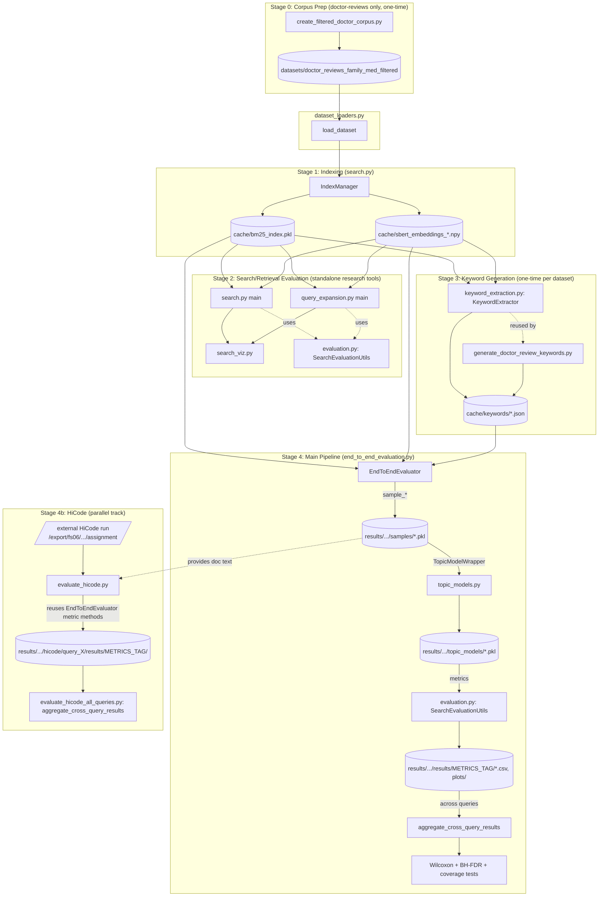

# Pipeline Architecture

This document explains how the ~10 scripts in this repo fit together, which stage each one implements, and how to run each stage standalone vs. as part of the full orchestrated pipeline.

For *why* the project exists and what it's measuring, see [PROJECT_OVERVIEW.md](PROJECT_OVERVIEW.md). For metric definitions, see [METRICS_GUIDE.md](METRICS_GUIDE.md). For cache layout and invalidation, see [CACHING.md](CACHING.md). For running any of this on the CLSP SLURM grid, see [GRID_WORKFLOW.md](GRID_WORKFLOW.md).

---

## The five stages

| # | Stage | Standalone entry point(s) | Runs as part of the main pipeline? |
|---|-------|---------------------------|-------------------------------------|
| 0 | Corpus prep (dataset-specific, one-time) | `create_filtered_doctor_corpus.py` | No — prerequisite, run once per dataset |
| 1 | Indexing | `src/search.py` (`IndexManager`) | Yes, transparently (builds/loads cache on first use) |
| 2 | Search / retrieval pipeline evaluation | `src/search.py main()`, `src/query_expansion.py main()` | No — standalone research tools, not invoked by `end_to_end_evaluation.py` |
| 3 | Keyword generation | `src/keyword_extraction.py main()`, `generate_doctor_review_keywords.py` | No — prerequisite, run once per dataset, output consumed later |
| 4 | Sampling → Topic Modeling → Final Evaluation | `src/end_to_end_evaluation.py` | This **is** the main pipeline |
| 4b | HiCode (parallel track) | `src/evaluate_hicode_all_queries.py` / `src/evaluate_hicode.py` | Separate entry point; reuses stage 4's metric code, not its sampling/indexing |

The most common mistake when picking up this repo: assuming everything runs through `end_to_end_evaluation.py`. Stages 0, 2, and 3 are **separate scripts you run once, ahead of time**, whose *output* (a filtered corpus on disk, a JSON keyword cache) stage 4 then reads. Stage 4 does not orchestrate them.

---

## Data flow

---

## Stage 0 — Corpus prep (doctor-reviews only)

`create_filtered_doctor_corpus.py` applies the 9 documented filters (see `DOCTOR_REVIEW_FILTERING_GUIDE.md`) to the raw doctor-reviews data and saves a HuggingFace-disk-format corpus. This is a one-time step per dataset version — re-run only if the filtering logic or source data changes. TREC-COVID needs no equivalent step; it loads directly from HuggingFace (`BeIR/trec-covid`).

Output consumed by: `dataset_loaders.py`'s `_load_doctor_reviews()`.

---

## Stage 1 — Indexing

Implemented in `src/search.py`:
- `TextPreprocessor` — tokenization/stemming shared by BM25 and evaluation
- `IndexManager.build_bm25_index()` / `.build_sbert_index()` — build or load cached BM25 and SBERT indices, keyed by `dataset_name`
- `SearchEngine` — wraps both indices and exposes `search()` with `RetrievalMethod` (BM25 / SBERT / HYBRID) and `HybridStrategy` (SIMPLE_SUM / RRF) options, plus optional MMR diversity reranking and cross-encoder reranking

This stage isn't run standalone in normal use — every other stage that needs indices (`end_to_end_evaluation.py`, `query_expansion.py`, `keyword_extraction.py`) instantiates `IndexManager` itself and gets the cached index transparently on repeat runs. See [CACHING.md](CACHING.md) for the cache key/invalidation details.

---

## Stage 2 — Search / retrieval pipeline evaluation

Two **standalone, non-orchestrated** research tools live here — this is the "search pipeline evaluation" layer, distinct from the topic-modeling evaluation in Stage 4:

- **`src/search.py main()`** — compares BM25 / SBERT / Hybrid(Simple-Sum) / Hybrid(RRF) retrieval quality against TREC-COVID qrels, reporting Precision@20 and Recall@1000. Saves `search_evaluation_results.json`. All BM25/SBERT/eval parameters are edited directly in `main()` (see USAGE.md's Configuration Reference).
- **`src/query_expansion.py main()`** — a broader exploration tool comparing query-expansion *methods* (`QueryExpansionMethod`: KEYBERT / PMI / SOPMI / COMBINED) combined with the retrieved baseline via different `QueryCombinationStrategy` options (WEIGHTED_RRF / CONCATENATED / CONCATENATED_RERANKED). Outputs to `results/query_expansion/`, using `search_viz.py` for comparison plots (precision/recall bars, F1, radar chart, heatmaps).

Both reuse `evaluation.py`'s `SearchEvaluationUtils` for Precision@K/Recall@K against qrels — the same utility class `end_to_end_evaluation.py` uses for the `relevant_concentration` metric.

**Important:** `end_to_end_evaluation.py`'s `sample_query_expansion()` (Stage 4) does **not** use the full `QueryExpander` class from this stage — it has its own simpler, inline implementation (load cached KeyBERT keywords → weighted RRF fusion at a fixed 70/30 split). `query_expansion.py` is for *researching* which expansion strategy to use; the fixed strategy that won that research is what's hardcoded into Stage 4's sampling method.

---

## Stage 3 — Keyword generation

Produces the JSON keyword cache that Stage 4's `query_expansion` sampling method depends on. Two scripts, same underlying class (`keyword_extraction.py`'s `KeywordExtractor`), different datasets:

- **`src/keyword_extraction.py main()`** — generated the TREC-COVID cache (`cache/keywords/keybert_k10_div0.7_top10docs_mpnet_k1000_ngram1-2.json`): 10 keywords/query, diversity=0.7, extracted from the top-10 retrieved docs, MPNet embeddings, unigram+bigram.
- **`generate_doctor_review_keywords.py`** — same parameters, doctor-reviews dataset, hardcoded to 6 queries (`1`-`6`) and writes to `cache/keywords/doctor_reviews_keybert.json`. See [CACHING.md](CACHING.md) for what happens for queries `7`-`11`, which have no cached keywords (it's a graceful fallback, not a crash).

Run once per dataset; re-run only if you change extraction parameters or add queries.

---

## Stage 4 — Sampling → Topic Modeling → Final Evaluation (the main pipeline)

This is `src/end_to_end_evaluation.py`, orchestrated by `EndToEndEvaluator`. Per query:

1. **Sampling** — 7 `sample_*()` methods, each returning `{doc_ids, doc_texts, method, ...}`, cached independently (see [CACHING.md](CACHING.md)):

   | Method name | Function | What it does |
   |---|---|---|
   | `random_uniform` | `sample_random_uniform` | Uniform random sample, no relevance signal (control) |
   | `keyword_search` | `sample_keyword_search` | BM25 only |
   | `sbert` | `sample_sbert` | Pure semantic (SBERT) retrieval only |
   | `direct_retrieval` | `sample_direct_retrieval` | Hybrid BM25+SBERT, Simple-Sum fusion |
   | `direct_retrieval_mmr` | `sample_direct_retrieval_mmr` | Same as above + MMR diversity reranking (λ=0.3) |
   | `query_expansion` | `sample_query_expansion` | Cached KeyBERT keywords + baseline, weighted RRF (70/30) |
   | `retrieval_random` | `sample_retrieval_random` | Hybrid retrieval of a 5000-doc pool, then random sample 1000 |

2. **Topic modeling** — samples are handed to `topic_models.py`'s `TopicModelWrapper(model_type=...)`, which dispatches to BERTopic / LDA / TopicGPT and always returns the same result dictionary shape regardless of model type (this is what makes cross-model metric code reusable). `TOPIC_MODEL_TYPE` is selected via the `MODEL` env var or edited directly in `main()`.

3. **Metrics & statistics** — per-method and pairwise metrics (see METRICS_GUIDE.md for all 40+), using `evaluation.py`'s `SearchEvaluationUtils` for qrels-based metrics plus a large block of inline metric/plotting code in `end_to_end_evaluation.py` itself. Significance testing (`run_pairwise_statistical_tests`, `run_pairwise_coverage_statistical_tests`) runs Wilcoxon signed-rank (primary) and paired t-test (secondary), both BH-FDR corrected.

4. **Cross-query aggregation** — `aggregate_cross_query_results()` combines all queries' `per_method_summary.csv`/`pairwise_metrics.csv` into `aggregate_results/{metrics_tag}/`.

Configuration surface (dataset, topic model, embedding models, sampling/force flags) is documented in full in [USAGE.md](USAGE.md)'s Configuration Reference — it's large enough to warrant its own section rather than duplicating here.

---

## Stage 4b — HiCode (parallel track)

HiCode is an LLM-based inductive-coding topic model that assigns **multiple** topics per document, run as a *separate external process* (not part of this repo) whose output lives on the CLSP grid filesystem (currently `/export/fs06/mzhong8/hicode/results/assignment` — see [GRID_WORKFLOW.md](GRID_WORKFLOW.md) for the access caveat). This repo only evaluates that output:

- **`src/evaluate_hicode.py`**'s `run_hicode_evaluation()` — converts HiCode's multi-label format to the single-label format the rest of the pipeline expects (takes the first assigned topic), then constructs an `EndToEndEvaluator` via `object.__new__()` (bypassing `__init__`, since there's no search index or sampling step for HiCode — the documents are whatever HiCode was given) and manually wires up just the attributes the metric-computation methods need. This includes `_metrics_tag`, computed the same way `__init__` does it, so HiCode's output nests under `results/{metrics_tag}/` consistent with the other topic models.
- **`src/evaluate_hicode_all_queries.py`** — runs the above across all discovered queries and calls the shared `aggregate_cross_query_results()`, passing the matching `metrics_model_tag` so aggregation finds what the per-query step wrote.

Because HiCode reuses `EndToEndEvaluator`'s methods via a hand-built instance rather than the normal constructor, **any new attribute the shared metric code starts depending on must also be added to `evaluate_hicode.py`'s manual setup block** (around line 686-693) — it will not inherit new `__init__` defaults automatically. This is the exact class of gap that existed here before this handover pass (see git history around the Wilcoxon/dual-embedding-model change).

---

## "Which script do I run for X?"

| I want to... | Run |
|---|---|
| Run the full experiment for a query/dataset/topic-model | `src/end_to_end_evaluation.py` (configure via `DATASET`/`MODEL` env vars + `main()` constants) |
| Just check retrieval quality (Precision/Recall vs qrels) | `src/search.py` |
| Compare query-expansion strategies | `src/query_expansion.py` |
| Generate/refresh the KeyBERT keyword cache | `src/keyword_extraction.py` (TREC-COVID) or `generate_doctor_review_keywords.py` (doctor-reviews) |
| Prepare the doctor-reviews corpus from scratch | `create_filtered_doctor_corpus.py` |
| Evaluate HiCode's output | `src/evaluate_hicode_all_queries.py` |
| Aggregate results across queries I've already run | Happens automatically at the end of `end_to_end_evaluation.py` and `evaluate_hicode_all_queries.py` when >1 query succeeds; call `aggregate_cross_query_results()` directly for a custom subset |
| Submit any of the above to the CLSP grid | See [GRID_WORKFLOW.md](GRID_WORKFLOW.md) |
